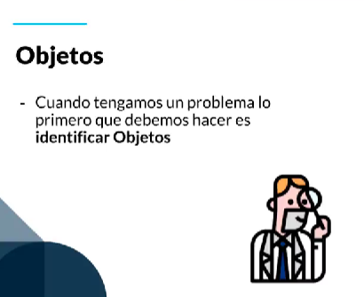
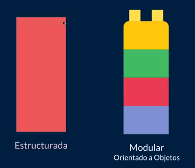

# ¿Qué es un objeto?

Un objeto es una entidad que tiene un estado, un comportamiento y un identificador único. Un objeto es una instancia de una clase.

Todo proviene de objetos

la Programación Orientada a Objetos (POO) lo que hace en realidad es resolver problemas por medio de la modelación del problema para ayudarnos a plasmarlo en código.

# ¿Qué es una clase?

Una clase es un modelo que define un conjunto de atributos y métodos que compartirán los objetos instanciados a partir de ella.

Una Clase Es el modelo sobre el cual nuestros objetos se construyen.

Es decir si tenemos un objeto llamado perro y este tiene sus atributos que lo describen generalmente y a su vez tiene métodos donde se define las acciones que pueda hacer ese perrito. Una clase me permite generar mas objetos (mas perros) con mismos atributos y métodos pero con resultados diferentes

# ¿Qué es abstracción?

La abstracción es un proceso mental mediante el cual se separan las características esenciales de un objeto o concepto, para poder comprenderlo mejor y representarlo de manera simplificada. En otras palabras, se trata de identificar lo más importante y relevante de algo y dejar de lado los detalles menos importantes.Clase y abstaccion

# La modularidad

Es Dividir un sitema y así crear módulos independientes, lo que permite evitar un colapso masivo en nuestro código y mejorar la legibilidad.

Lema de la programación: Divide y vencerás.

