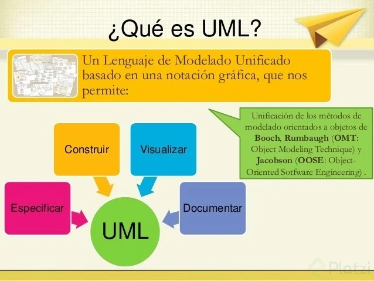

Despues del analicis del problema se debe de plasmar en un diagrama para poder entender el problema y la solución con la orientación a objetos.

## Diagramas de Modelado

Nos permiten plasmar de forma gráfica a través de diagramas nuestro análisis. Servirá de intermediario para poder entender el problema y la solución con la orientación a objetos.

El diagrama UML se debe de tener si o se en un proyecto orientado a objetos

## Diagramas UML

### Diagrama de Clases
Representa la estructura estática de un sistema, mostrando las clases, sus atributos, métodos y las relaciones entre ellas.

### Diagrama de Objetos
Muestra una instancia particular de una clase, sus atributos y las relaciones que tiene con otros objetos.

### Diagrama de Casos de Uso
Representa la funcionalidad del sistema desde el punto de vista del usuario, mostrando los actores y los casos de uso que se pueden realizar.

### Diagrama de Actividades
Describe el flujo de trabajo o proceso de un sistema, mostrando las actividades que se realizan y cómo se relacionan entre sí.

## Herramientas

Existen muchas herramientas para trabajar con UML
- StarUML
- ArgoUML
- Lucidchart

# En resumen
