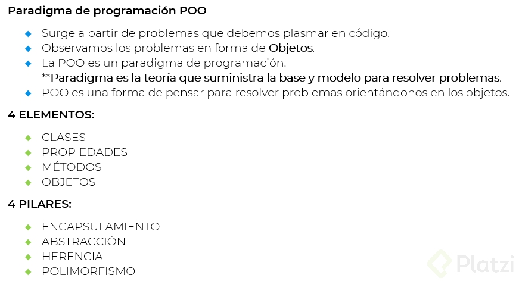

# Poo
 
# Beneficios de la  programación orientada a objetos

[1] Programar más rapido: Tener  un análicis de  lo que se está realizando va a ayudar a que se genere código mucho mas veloz siempre que se tome el tiempo para análizar y retomar el problema antes de ir al código porque de esta manera se puede saber lo que se quiere hacer  y como hacerlo

# ¿ Qué debemos hacer con la programación orientada a objetos?

## Analizar 

[1] Observar el problema y analizarlo para poder entenderlo y poderlo resolver
[2] Entender el problema y saber que es lo que se quiere hacer
[3] Saber que es lo que se quiere hacer y como se va a hacer

## Plasmar 
[1] Plasmar el análicis en un diagrama para poder entender el problemas  y ver la posible solución

## Programar
[1] Programar la solución del problema en código que se acaba de diagramar 

# ¿Qué resuelve la Programación orientada a objetos?

