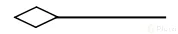

## Elementos para hacer las representaciones graficas 

## Clases

Las clases se representan con un rectangulo dividido en tres partes:
- Nombre de la clase
- Atributos
- Metodos

En la parte superior se colocan los atributos o propiedades, y debajo las operaciones de la clase. Notarás que el primer caracter con el que empiezan es un símbolo. Este denotará la visibilidad del atributo o método, esto es un término que tiene que ver con Encapsulamiento y veremos más adelante a detalle.

Estos son los niveles de visibilidad que puedes tener:

- private
+ public
"#" protected
~ default

## Relaciones
Las relaciones se representan con una linea que une dos clases y un texto que indica el tipo de relacion.

### Asociacion

Es la relación más simple que puede haber entre dos clases. Se representa con una linea continua.
cada vez que esté referenciada este tipo de flecha significará que ese elemento contiene al otro en su definición. La flecha apuntará hacia la dependencia.

Con esto vemos que la ClaseA está asociada y depende de la ClaseB.

### Herencia

Siempre que veamos este tipo de flecha se estará expresando la herencia.
La dirección de la flecha irá desde el hijo hasta el padre.

Con esto vemos que la ClaseB hereda de la ClaseA

### Agregacion

La agregación es una relación que indica que una clase es parte de otra clase. Se representa con una linea continua y un rombo en el extremo de la linea que apunta a la clase que contiene a la otra.

Este se parece a la asociación en que un elemento dependerá del otro, pero en este caso será: Un elemento dependerá de muchos otros. Aquí tomamos como referencia la multiplicidad del elemento. Lo que comúnmente conocerías en Bases de Datos como Relaciones uno a muchos

Con esto decimos que la ClaseA contiene varios elementos de la ClaseB. Estos últimos son comúnmente representados con listas o colecciones de datos.

- Composicion

